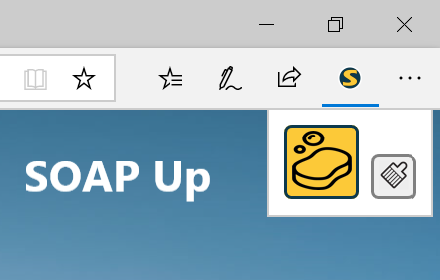

OAP Up
===================================================

SOAP Up is a cross-platform browser extension that streamlines "SOAP note" patient reporting for ESO users. The goal of this project is to eliminate redundancy in the <a href="https://www.esosuite.net">ESO</a> workflow of emergency first-responders by storing, retrieving, formatting and populating priorly submitted information into the "Narrative" section of any record.

Screenshots
===========

License
=======

 SOAP Up by <a xmlns:cc="http://creativecommons.org/ns#" href="https://github.com/styson12/soap_up" property="cc:attributionName" rel="cc:attributionURL">Scott Tyson</a> is licensed under a <a rel="license" href="http://creativecommons.org/licenses/by-nc-nd/4.0/">Creative Commons Attribution-NonCommercial-NoDerivatives 4.0 International License</a>. Based on a work at <a xmlns:dct="http://purl.org/dc/terms/" href="https://github.com/styson12/soap_up" rel="dct:source">https://github.com/styson12/soap_up</a>.